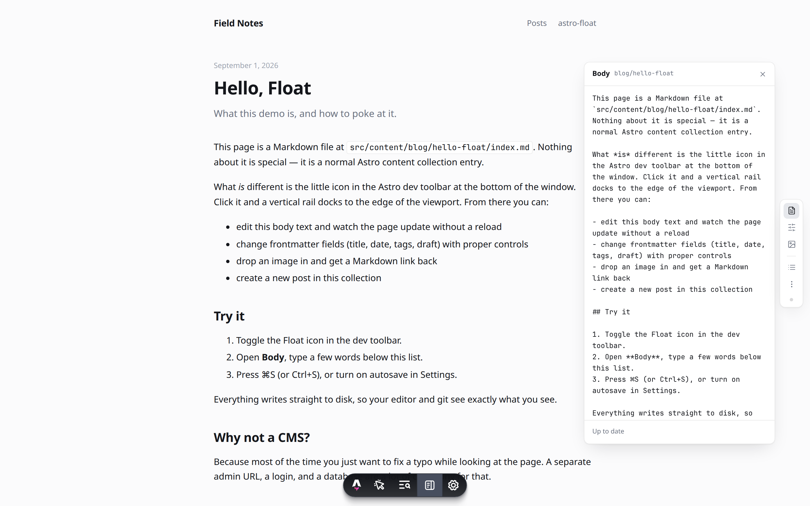
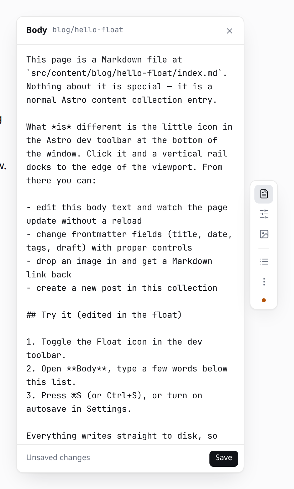

# astro-float

A proof-of-concept floating content editor for Astro content collections. It lives in the **Astro Dev Toolbar** — one icon toggles a vertical rail docked to the edge of the page — and writes Markdown straight to disk while you look at the rendered page.

No `/admin`, no desktop app, no CMS studio. Dev-only: the integration adds nothing to production builds.



## Preview it

```sh
git clone https://github.com/iannuttall/astro-float
cd astro-float
pnpm install
pnpm dev
```

Open <http://localhost:4321/blog/hello-float/>, move the mouse to the bottom of the window to reveal the Astro dev toolbar, and click the **Float** icon (the last one before Settings).

> Local `astro dev` is the only real preview path — the editor writes to your filesystem. A Vercel/Netlify preview would only show the plain blog, since the integration is stripped from builds.

## What you can do from the float

| Rail icon | Panel | What it does |
| --- | --- | --- |
| Document | **Body** | Edit the entry's Markdown. Save with **⌘S / Ctrl+S**, the **Save** button (appears only when dirty), or autosave. The page re-renders in place — no reload, scroll and caret preserved. Drop or paste images straight into the editor. |
| Sliders | **Fields** | Frontmatter as a form. Types are inferred from the values: text, long text, number, date, tags (`string[]`), boolean switch, JSON fallback. Add or remove fields. |
| Image | **Images** | Drop zone + grid of images already colocated with the entry. Uploads land next to the entry (`src/content/blog/<post>/photo.png`) and a `` link is inserted at the cursor. Astro's asset pipeline picks the relative path up as normal. |
| List | **Collection** | Every entry in the collection (switch collections if there are several), the current one marked. **New** creates an entry with frontmatter inferred from its siblings and navigates to it. |
| Dots | **Settings** | Dock left/right, autosave toggle, shortcuts, and the file path of the current entry. |

<p>
  
  
</p>


## Repo layout

```
packages/astro-float/   the integration (what you'd publish to npm)
  src/index.js            Astro integration: registers the toolbar app + dev API
  src/server/api.js       /__float/api/* endpoints (localhost-only JSON)
  src/server/content.js   frontmatter parse/serialize, collection discovery, uploads
  src/server/sync-gate.js swallow Astro's post-save reload, signal "content synced"
  src/toolbar/app.ts      defineToolbarApp() entry
  src/toolbar/float.ts    the rail + panels (vanilla TS, shadow DOM, no framework)
  src/toolbar/styles.ts   cool-gray tokens, hairlines, light + dark
demo/                   a minimal Astro 5 blog with a `blog` collection and 4 posts
docs/                   screenshots
```

## Using it in your own Astro project

```js
// astro.config.mjs
import { defineConfig } from "astro/config";
import astroFloat from "astro-float";

export default defineConfig({
  integrations: [astroFloat()],
});
```

Zero config: every directory under `src/content/` that holds Markdown is treated as a collection. Float works out which entry a page renders by matching the URL tail against entry ids; for anything unusual, bind it explicitly:

```astro
<article data-float-entry={`blog:${post.id}`}>…</article>
```

Options, all optional:

```js
astroFloat({
  contentDir: "src/content",            // where collections live
  collections: {                         // pin dirs/routes instead of discovering them
    blog: { dir: "src/content/blog", route: "/blog/[id]" },
  },
  allowRemote: false,                    // answer non-localhost requests (astro dev --host)
  maxUploadBytes: 15 * 1024 * 1024,
});
```

## How it works

- **Dev toolbar app.** `addDevToolbarApp()` in `astro:config:setup` (only when `command === "dev"`). The rail and panels render into the app's shadow root, so nothing leaks into the host page's CSS and vice versa. Toggling the toolbar icon shows/hides the canvas; open state survives reloads via `sessionStorage`.
- **API.** `astro:server:setup` mounts `/__float/api/*` on the Vite dev server: list collections, read/write an entry, create an entry, list/upload media. Requests must come from `localhost` (host header and socket address), be same-origin, and carry an `x-astro-float` header for mutations. Paths are confined to the collection directory; images are extension-allowlisted.
- **Files.** Frontmatter goes through `yaml` (key order kept, quoting normalized); the body is kept byte-for-byte. Saves carry the hash of the file as loaded — if it changed on disk in the meantime you get a 409 and a Reload / Overwrite choice instead of a silent clobber.
- **Live update without reload.** Astro's content layer re-syncs a changed entry and asks the browser to full-reload, which would kill the editor mid-keystroke. `sync-gate.js` opens a 3s quiet window after each Float save, swallows that reload, and uses it as the "synced" signal: the save endpoint responds only once the store has the new content, the client fetches the fresh HTML and swaps everything except the toolbar. Edits from your IDE still reload normally.

## Intentionally out of scope for v0

- Reading Zod schemas from `content.config.ts` — field types are inferred from values. Next step: parse the schema (or `astro sync` output) to drive controls and validation.
- MDX bodies are treated as plain text; no component awareness.
- Rich-text / WYSIWYG editing on the page itself. The body panel is a Markdown textarea on purpose.
- Creating collections, deleting entries, renaming slugs, git operations.
- Non-Markdown loaders (JSON/YAML data collections, remote loaders).
- Live-loader / view-transitions (`<ClientRouter />`) pages — untested.
- Auth, multi-user, production use. This only runs under `astro dev` on localhost.

## Notes

- Astro prints `[glob-loader] Duplicate id … found` after every content save. That's Astro's own watcher log for changed files, not a Float bug.
- Tested against Astro 5.18 / Vite 6. The sync gate relies on the content layer sending `{ type: "full-reload", path: "*" }` after a data-store write; other majors are unverified.
- Prefs (dock side, autosave, last panel) live in `localStorage` under `astro-float:*`.
