# astro-float

A proof-of-concept content editor for Astro content collections that lives **on the page**. In `astro dev` the rendered entry is editable in place — title, description and the Markdown body — and a thin dark rail (a vertical sibling of Astro's own dev toolbar pill) sits tucked at the right edge for the few things that can't live in the text: the rest of the frontmatter, the collection, a read-only view of the Markdown that's about to hit disk, settings.

No `/admin`, no desktop app, no CMS studio, no side textarea, no toolbar icon to find. Dev-only: the integration adds nothing to production builds.

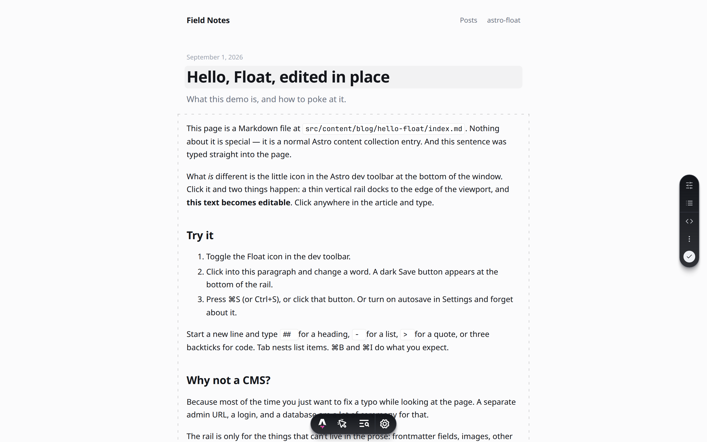

## Preview it

```sh
git clone https://github.com/iannuttall/astro-float
cd astro-float
pnpm install
pnpm dev            # or: pnpm --filter demo exec astro dev
```

Open <http://localhost:4321/blog/hello-float/>. The rail slides in, then tucks itself away at the edge. Click into the title or the article and type.

> Local `astro dev` is the only real preview path — the editor writes to your filesystem. A Vercel/Netlify preview would only show the plain blog, since the integration is stripped from builds.

## On the page

| | |
| --- | --- |
| **Type** | The body under `[data-float-body]` is `contenteditable` whenever the dev server is running. Native caret, native undo, native spellcheck. Links don't navigate while editing (⌘-click does). |
| **Title & co.** | Elements marked `data-float-field="title"` (or any string frontmatter key printed verbatim) are editable in place too — plain text, Enter to finish. They're two-way synced with the Fields panel and save through the same path. Fields that aren't on the page (dates, tags, booleans) live in the panel. |
| **Components** | MDX components and raw-HTML blocks are **islands**: no caret goes in, and clicking one shows a small bar — move up / down, drag grip, remove (with an inline confirm). Their source is written back verbatim wherever they end up. Backspace against an island selects it instead of eating it. |
| **Save** | The dot at the bottom of the rail becomes a white Save button the moment the page differs from disk, and stays put while you type. **⌘S / Ctrl+S** works anywhere. Optional autosave (800ms after you stop typing) in Settings. |
| **Shortcuts** | At the start of an empty line: `# `…`###### ` heading, `- ` / `* ` bullet, `1. ` numbered, `> ` quote, ``` ``` ``` code block. **Tab / ⇧Tab** nest and un-nest list items. **⌘B / ⌘I** bold / italic, **⌘K** link. Inside a code block Enter is a newline; ⇧Enter leaves it. **Esc** leaves the text. |
| **Images** | Drop or paste an image onto the prose. The file is copied **next to the entry** (`src/content/blog/<post>/photo.png`), appears where you dropped it, and is written as ``. That's the only image UI — no panel. |
| **Live preview** | While your caret is in the text, a save doesn't touch the DOM — what you typed *is* the preview. Save from the rail (or with the caret elsewhere) and Astro re-renders the page in place, no reload, scroll kept. |
| **Moving around** | Same-origin links, back/forward and Float's own "create" flows are soft navigations: the next page is fetched and swapped in under the rail. No unload, so no "Leave site?" dialog — pending edits are saved first. The rail never re-animates and panels never re-open on their own. |

## The rail

<p>
  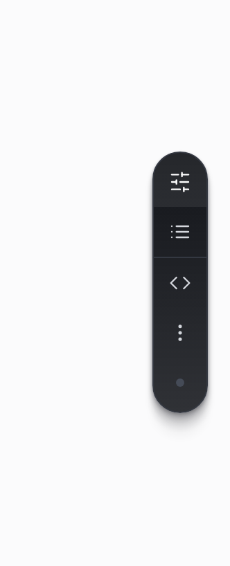
</p>

| Icon | Panel | |
| --- | --- | --- |
| Sliders | **Fields** | Frontmatter as a form. Controls inferred from values: text, long text, number, date, tags (`string[]`), boolean switch, JSON fallback. Add / remove fields. |
| List | **Collection** | Entries in the selected collection (dropdown if there are several), current one marked. **+ New entry** creates an entry in *that* collection. **New collection** — a separate row and form — creates `src/content/<name>/`, registers it in `content.config.ts`, seeds a first entry and opens it. |
| `<>` | **Source** | Read-only escape hatch: the exact Markdown that Save will write. (Editable only when the page has no `data-float-body`.) |
| ⋮ | **Settings** | Dock left / right, autosave, shortcut cheat-sheet, current file. |
| Bottom slot | **Status / Save** | Quiet dot: gray idle · amber unsaved · pulsing saving · green saved · red error. Becomes the Save button when there's something to save and autosave is off. |

<br clear="all">

Like Astro's bottom bar, the rail **rests tucked**: after sliding in it holds for a moment, then slips to a 14px sliver with faded icons. Hover brings it out (and it nudges a little further on hover); leave and it tucks again. An open panel or unsaved work keeps it out. Tooltips are Astro's too (dark, caret at the icon, slightly larger type). Panels open only when you click an icon and close when you navigate.

<p>
  
  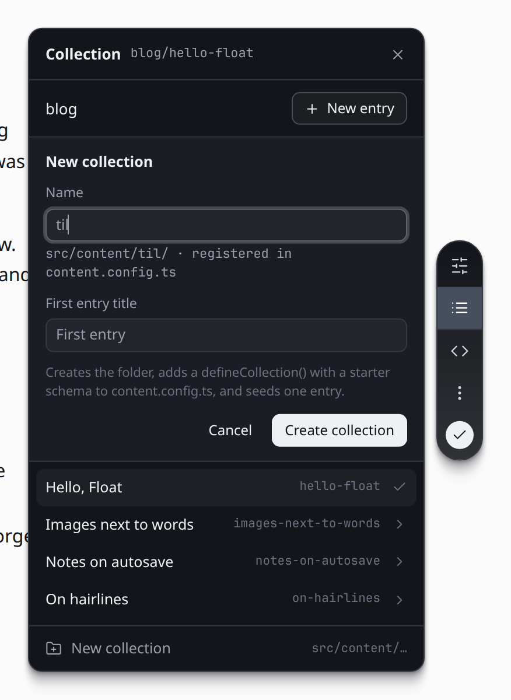
  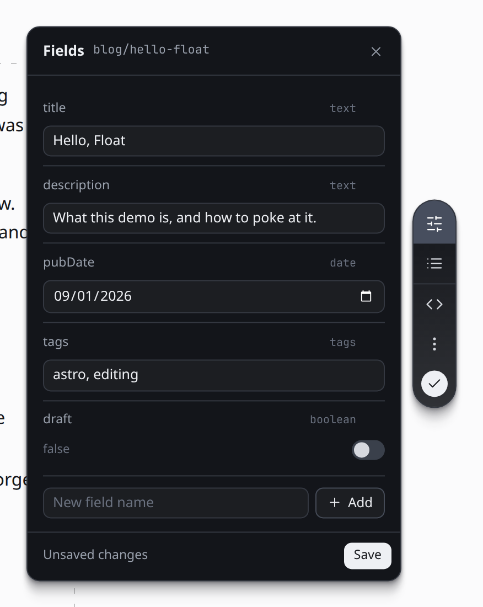
</p>


### On a phone

<p>
  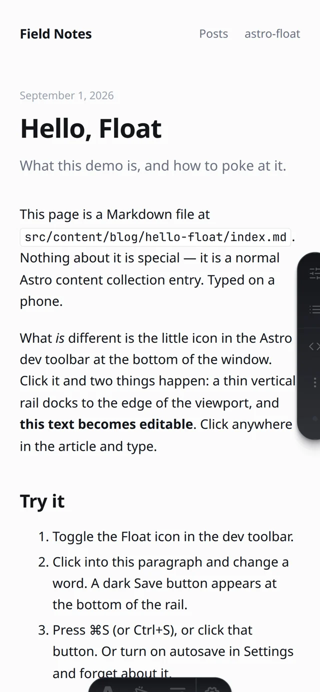
  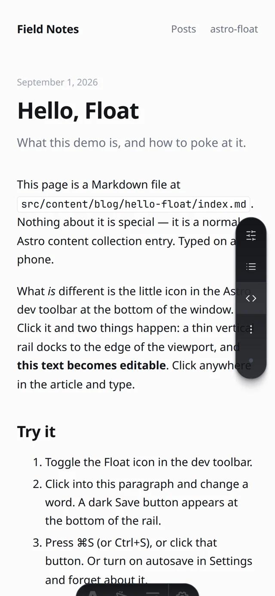
  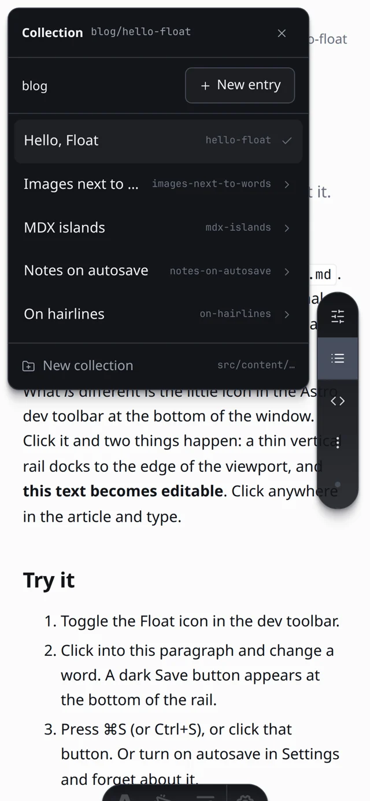
  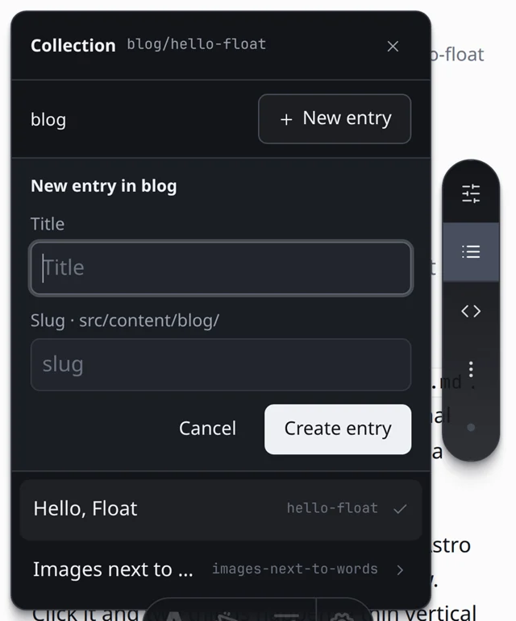
</p>
<p>
  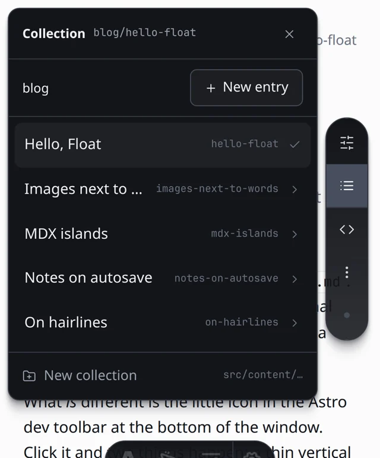
  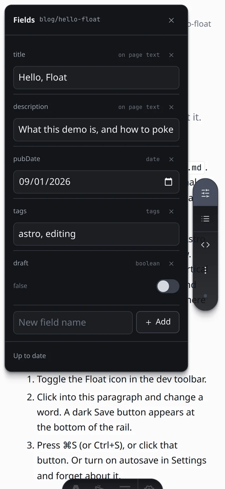
  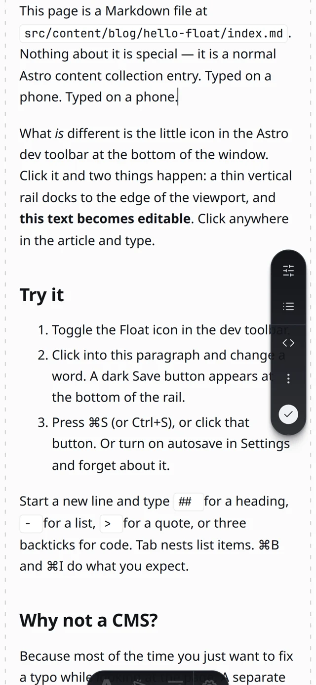
  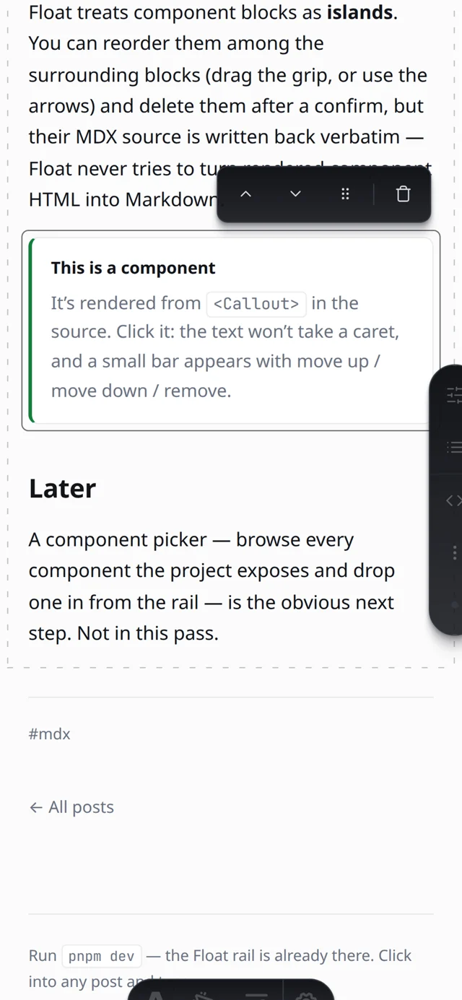
</p>

On touch devices (no hover + a touchscreen) the rail rests half-tucked; the **first tap expands it**, a second tap on the idle dot — or a tap anywhere on the page, or the panel's × — tucks it again. Below 640px the panel becomes a sheet pinned to the top-left *beside* the rail, sized to the **visual viewport**, so the on-screen keyboard shrinks it instead of hiding its buttons; content scrolls inside the sheet. Controls are 16px (no iOS focus-zoom), rail targets are 44px, safe-area insets are respected. Cancel on a form puts the list back exactly as it was, blurs the field, and — if Safari did zoom — snaps the viewport back.

## Using it in your own Astro project

```js
// astro.config.mjs
import { defineConfig } from "astro/config";
import astroFloat from "astro-float";

export default defineConfig({
  integrations: [astroFloat()],
});
```

Then mark the element that wraps your rendered Markdown:

```astro
---
const { Content } = await render(post);
---
<article data-float-entry={`blog:${post.id}`}>
  <h1 data-float-field="title">{post.data.title}</h1>
  <p data-float-field="description">{post.data.description}</p>
  <div class="prose" data-float-body>
    <Content />
  </div>
</article>
```

- `data-float-body` — required for on-page editing. It must wrap **only** the rendered body (not the title or other frontmatter-driven markup), because its children are what gets written back as Markdown.
- `data-float-field="title"` — optional, on any element that prints a string frontmatter value verbatim; it becomes editable in place. Skipped automatically if the rendered text doesn't match the value (formatted dates etc.).
- `data-float-entry="collection:id"` — optional. Without it Float matches the URL tail against entry ids (`/blog/hello-float/` → `hello-float`).

Zero config otherwise: every directory under `src/content/` that holds Markdown is a collection. Options, all optional:

```js
astroFloat({
  contentDir: "src/content",            // where collections live
  collections: {                         // pin dirs/routes instead of discovering them
    blog: { dir: "src/content/blog", route: "/blog/[id]" },
  },
  allowRemote: false,                    // answer non-localhost requests (astro dev --host)
  maxUploadBytes: 15 * 1024 * 1024,
});
```

### New collections and routes

"New collection" writes a `defineCollection()` with a glob loader and a starter schema (`title`, `description`, `pubDate`, `tags`, `draft`) into `src/content.config.ts` (or creates the file), and adds the key to `export const collections`. It's a text edit that only touches shapes it recognises; if it can't find `export const collections = { … }` it says so and leaves the file alone. Astro picks the change up without a restart.

A collection also needs pages. The demo ships generic `src/pages/[collection]/index.astro` and `src/pages/[collection]/[id].astro` routes that render any collection without a dedicated page, so `/til/first-entry/` works the moment it's created. In your own project you'd add whatever route you want; Float guesses `/<collection>/<id>/` until it has seen a real URL for that collection.

## How it works

- **Always-on client.** `injectScript("page", …)` in `astro:config:setup` (only when `command === "dev"`) mounts the rail into a shadow root on every page. No dev-toolbar registration; the Astro toolbar keeps doing its own thing.
- **Block-level round trip.** The server parses the body with `mdast-util-from-markdown` (+ GFM) and returns each top-level block's exact source slice. The client lines those up with the body's top-level DOM children. On save it aligns the current DOM against that snapshot (LCS on outerHTML): unchanged blocks emit their **original Markdown byte-for-byte**; only edited or new blocks go through the HTML→Markdown serializer. A one-word fix is a one-line diff.
- **Islands.** The server parses `.mdx` with `mdast-util-mdx`; `mdxJsxFlowElement`, raw `html` blocks and paragraphs made only of inline JSX/HTML are flagged. On the client those blocks get `contenteditable="false"`, a stable key, and are matched by that key (not by HTML) when serializing, so moving one just moves its source slice. Imports/exports and `{expressions}` are carried as non-rendering lead/trailers. An `.mdx` whose blocks don't line up with the DOM is body-read-only (frontmatter still saves) — Float never writes rendered component HTML into an MDX file.
- **HTML→Markdown** (`src/toolbar/html-to-md.ts`) covers what remark-rehype + Shiki emit: ATX headings, paragraphs, tight/loose and nested lists, task lists, links (with titles), images (Vite `/@fs/…` and Astro `/_image?href=…` URLs mapped back to `./relative`), inline code, fenced code with language, blockquotes, rules, GFM tables with alignment, strong / em / strike, hard breaks. Unknown elements pass through as raw HTML. Fidelity check: serializing the demo's rendered pages reproduces every source block identically.
- **API.** `astro:server:setup` mounts `/__float/api/*`: collections, read/write entry, create entry, create collection, upload media. Localhost-only (host header + socket address), same-origin, custom header on mutations, paths confined to the collection dir, image extension allowlist. Saves carry the file hash as loaded; a 409 gives you Reload / Overwrite instead of a silent clobber.
- **No reload on save.** Astro's content layer full-reloads the page after a content change. `sync-gate.js` swallows that reload for a few seconds after a Float write and uses it as the "synced" signal, so save/create responses only return once the store has the new content. If the caret is in the body the DOM is left alone; otherwise the client fetches fresh HTML and swaps everything but the toolbar and the rail. IDE edits still reload as normal.
- **Soft navigation.** A document-level click handler turns same-origin `<a>` clicks into fetch + swap + `pushState`; `popstate` does the reverse. Anything that fails falls back to a normal load. Pages that rely on their own scripts running on navigation won't get that in dev while Float is mounted (content sites don't notice; if yours does, say so and it can become opt-in).

## Known round-trip limits (v0)

Only blocks you edit are re-serialized, so these only bite inside a paragraph you actually touched:

- **Markdown style is normalized**: `*emphasis*`, `**strong**`, `-` bullets, `1.` numbering, ATX `#` headings, fenced code. Setext headings, `+`/`*` bullets, reference-style links (`[text][ref]`) and autolinks in an edited block come back as the inline/ATX forms.
- **Smartypants**: Astro renders `'`/`"` as `’`/`“”`; edited blocks write straight quotes back (renders the same). Em dashes and ellipses are kept as-is.
- **Raw HTML in Markdown** round-trips as raw HTML (fine), but if a raw-HTML block renders to more than one element, block counts won't line up and Float falls back to re-serializing the whole body (Settings and Source tell you when that happens).
- **Footnotes** (`[^1]`) live in a rendered footer section, which breaks the block alignment → whole-body fallback; an edited paragraph containing a footnote ref keeps the rendered `<sup>` as raw HTML.
- **MDX**: component blocks are islands (move / remove only, source verbatim). Prose *around* them edits normally. Inline components inside a paragraph (`Some text <Badge /> more`) aren't islands — that paragraph is treated as text and would be rewritten with the component's rendered HTML if you edit it. Hydrated `<astro-island>`s re-render themselves; they're keyed by identity so that's fine, but only tested with `.astro` components in the demo.
- **Custom remark/rehype plugins** that add wrappers (e.g. heading anchors, TOC) can change block counts or inject markup that gets serialized as HTML.
- **Escaping** is conservative: `* _ [ ] < \`` and line-leading `# - + > 1.` are escaped in edited text; `&` and `~` (single) are not.
- Programmatic conversions (typing `## ` etc.) aren't in the browser's undo stack. Native typing undo works.
- A `<br>` typed with ⇧Enter inside a paragraph becomes a two-space hard break.

## Intentionally out of scope for v0

- **Component picker** — browse the project's components and insert one from the rail (the "agents build the component, Float inserts it" flow). Islands are the groundwork; the catalog/insert UI is the next pass.
- Zod schema awareness for Fields (types are inferred from values); the starter schema for new collections is fixed
- Inline formatting toolbar / link popover (⌘B / ⌘I / ⌘K + Markdown shortcuts only)
- Deleting / renaming entries or collections, git operations
- JSON/YAML data collections, remote loaders, live-loader / `<ClientRouter />` pages
- Auth, multi-user, anything outside `astro dev` on localhost

## Repo layout

```
packages/astro-float/   the integration (what you'd publish to npm)
  src/index.js            Astro integration: injects the client + mounts the dev API
  src/server/api.js       /__float/api/* endpoints (localhost-only JSON)
  src/server/blocks.js    Markdown → top-level source blocks (mdast, with offsets)
  src/server/collections.js  create a collection: dir, content.config.ts wiring, seed entry
  src/toolbar/fields.ts   on-page frontmatter fields (title, description, …)
  src/server/content.js   frontmatter parse/serialize, collection discovery, entries, uploads
  src/server/sync-gate.js swallow Astro's post-save reload, signal "content synced"
  src/toolbar/client.ts   mounts the rail into a shadow root on every dev page
  src/toolbar/editor.ts   on-page contenteditable controller, block alignment, islands
  src/toolbar/html-to-md.ts  HTML → Markdown for edited blocks
  src/toolbar/float.ts    the rail + panels + soft navigation (vanilla TS, no framework)
  src/toolbar/styles.ts   Astro-toolbar palette: dark capsule, hairlines, caret tooltips
demo/                   a minimal Astro 5 blog (+ one .mdx post) + generic [collection] routes
docs/                   screenshots (docs/mobile/ for the phone set)
```

## Notes

- Astro prints `[glob-loader] Duplicate id … found` after every content save. That's Astro's own watcher log for changed files, not a Float bug.
- If you delete an image that a post referenced, Astro's `.astro/` asset cache can 500 the page until you restart `astro dev`.
- Tested against Astro 5.18 / Vite 6 / Chrome. The sync gate relies on the content layer sending `{ type: "full-reload", path: "*" }` after a data-store write; other majors are unverified. `contenteditable` behaviour is Chromium-tested; Safari/Firefox will differ in the details.
- Prefs (dock side, autosave) live in `localStorage` under `astro-float:prefs`. Which panel is open is never persisted. `astro-float:pointer` = `coarse` | `fine` forces touch/mouse mode (handy in VMs whose display reports no pointer).
- Mobile was exercised in Chrome's iPhone emulation (390×844, touch), including a 470px-tall viewport standing in for the open keyboard. Real iOS Safari differs: its keyboard resizes only the visual viewport (which Float tracks), `contenteditable` caret handling is Safari's own, and HTML5 drag of islands doesn't exist on touch — use the ▲/▼ buttons.
