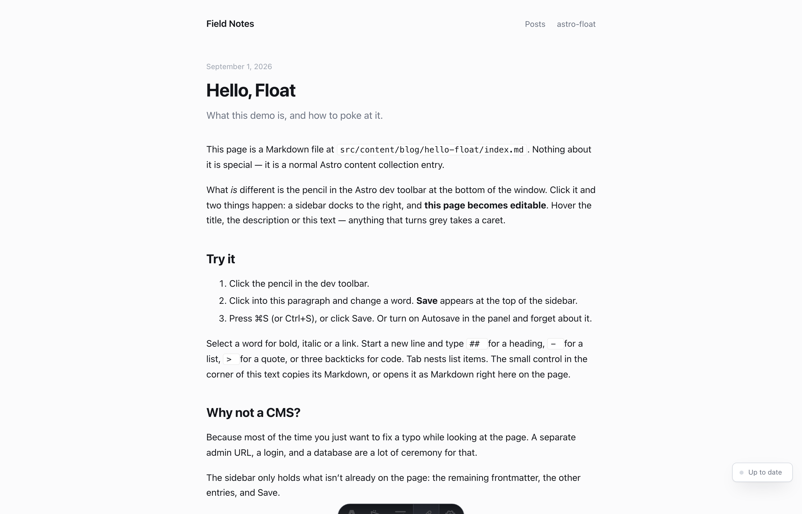
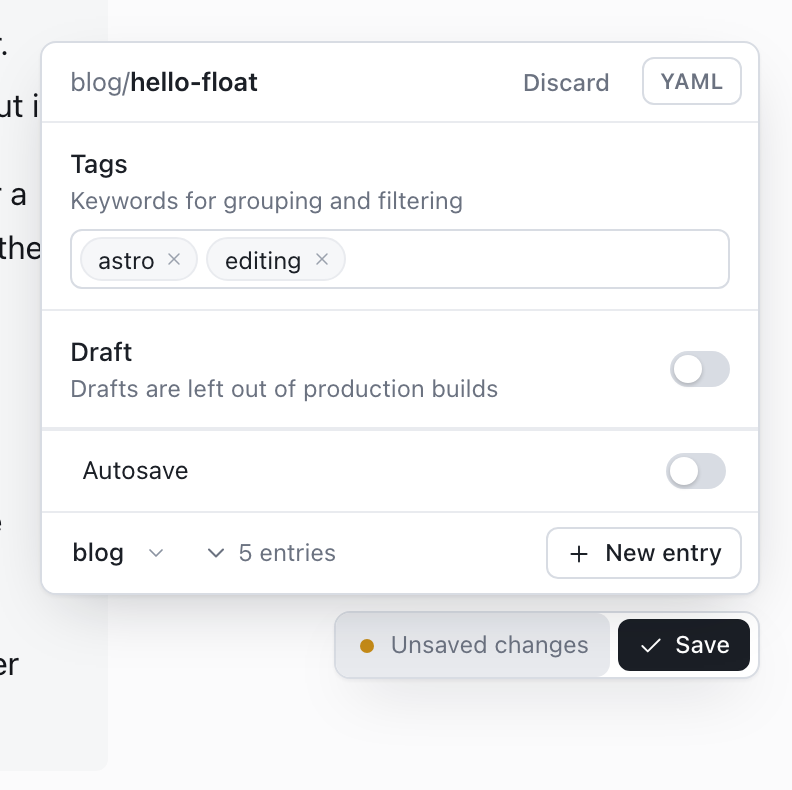
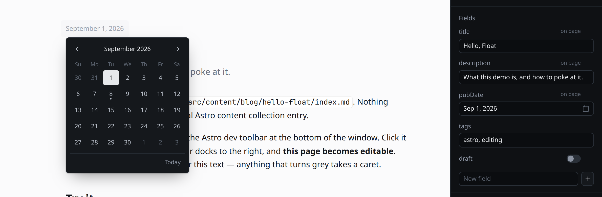

# astro-float

A proof-of-concept content editor for Astro content collections that lives **on the page**. Click **Edit** in the Astro Dev Toolbar and the rendered entry becomes editable where it sits — title, description, Markdown body. Anything editable takes a soft grey wash when you hover it; that's the whole visual language. A small **pill** at the bottom right shows the status and Save; click it for the few things that aren't on the page — the remaining fields (or the raw YAML), Autosave, new entries and collections. Turn Edit off and it's all gone.

No `/admin`, no desktop app, no CMS studio, no side textarea, no second always-on bar, no floating toolbar over the prose. Dev-only: the integration adds nothing to production builds.


## Preview it

```sh
git clone https://github.com/iannuttall/astro-float
cd astro-float
pnpm install
pnpm dev            # or: pnpm --filter demo exec astro dev
```

Open <http://localhost:4321/blog/hello-float/>, hover the bottom edge to reveal the Astro toolbar, and click the pencil (**Edit**). Hover the date, the title or the article — grey means editable — and type. Click the pencil again to leave (unsaved work is saved first).

```sh
pnpm test              # unit tests (vitest): serializer round trips, block splitting, schema mapping, frontmatter
pnpm test:e2e:setup    # once: download Chromium for Playwright
pnpm test:e2e          # browser tests against the demo (starts its own astro dev on a free port)
```

> Local `astro dev` is the only real preview path — the editor writes to your filesystem. A Vercel/Netlify preview would only show the plain blog, since the integration is stripped from builds. Set `allowRemote: true` to preview through a tunnel.



## On the page

| | |
| --- | --- |
| **Grey = editable** | With Edit on, hovering the title, the description, the body or any other bound field paints a soft grey wash behind it (lighter while your caret is inside). The wash is a pseudo-element painted behind the text and takes part in no layout — nothing moves when it appears. |
| **Type** | The body under `[data-float-body]` is `contenteditable`. Native caret, native undo, native spellcheck. Links don't navigate while editing (⌘-click does). |
| **Title, description** | Elements marked `data-float-field="<key>"` whose text is the frontmatter string verbatim are plain-text editable in place — Enter finishes. Anything edited on the page is left out of the pill's popover; edit it where it sits. |
| **Date** | A `data-float-field` element that prints a frontmatter date (`YYYY-MM-DD`, or that with a time suffix) formatted — `<time data-float-field="pubDate">` in the demo — becomes a button: click it (or Enter) and a small **calendar** opens under it. Float finds the Intl format the page used by reproducing the rendered text (or trusts a matching `datetime`), so the pick is re-formatted the same way on the page and written back in the value's original shape (date part swapped, any `T09:30:00Z` kept). A date field that isn't on the page gets the same calendar in the pill's popover. Keyboard: arrows, PageUp/Down, Home/End, Enter, Esc. |
| **Body control** | While the body has your caret or the pointer, a quiet **copy** / **source** control sits inside the top-right corner of its wash — no pill, part of the wash, fading with it, and pinned inside the visible part of the prose as you scroll. Copy takes the body's Markdown; **Source** replaces the prose in place with a Markdown textarea of the same height, opened on the block you were looking at, at the height it had. Type there, click **Rendered**: it saves, swaps in the fresh render and puts the caret back in the block you were on, where it was on screen. If the save fails it says why right there, stays in source, and offers **Discard**. It's the only raw-Markdown mode: the body is edited on the page, never in the popover. Fields (title, description, date) never get a control. |
| **Selection bubble** | Double-click or select text and a tiny bubble appears above it: **H1 / H2 / H3** (turn the block into that heading; again to go back to a paragraph — only on plain blocks, not inside lists, quotes or code), then bold, italic, link (inline URL field, Enter applies, Esc cancels). Gone on click-away. ⌘B / ⌘I / ⌘K still work. |
| **Components** | MDX components and raw-HTML blocks are **islands**: no caret goes in, and clicking one shows a small bar — move up / down, drag grip, remove (inline confirm). Their source is written back verbatim wherever they end up. |
| **Shortcuts** | At the start of an empty line: `# `…`###### `, `- ` / `* `, `1. `, `> `, ``` ``` ```. **Tab / ⇧Tab** nest lists. In a code block Enter is a newline, ⇧Enter leaves it. **Esc** leaves the field (it never turns Edit off — the pencil does). |
| **Images** | Drop or paste onto the prose. The file is copied **next to the entry**, appears where you dropped it, and is written as ``. |
| **Video** | Drop or paste a video file (mp4, webm, mov, m4v) the same way. It is copied to `public/media/<collection>/<id>/` (Astro only processes Markdown *images* from `src/`, so a video has to be served as-is) and written as a raw `<video controls src="/media/…/clip.mp4"></video>` block, which is an island: move it, remove it, no caret. Up to 200 MB (`maxVideoBytes`). |
| **Embeds** | Paste a YouTube, Vimeo or X/Twitter link on an **empty line** and it becomes an embed island: `<figure class="embed"><iframe …></iframe></figure>` for videos (YouTube keeps a `t=` start time), Twitter's own `blockquote.twitter-tweet` + `widgets.js` for a post. A direct link to a video file becomes a `<video>`. Paste the same link inside a sentence and it stays text. |
| **Save / Discard** | The pill at the bottom right: status text, and **Save** the moment the page differs from disk (it stays put while you type; **Discard** is in the pill's popover). If Astro rejects what was written (a value the collection's schema won't take) the status says so in amber and Save stays. Discard puts the body, the frontmatter, the on-page fields and the source view back to what's on disk without writing anything. **⌘S / Ctrl+S** anywhere. Optional **Autosave** (a switch in the header; 800ms after you stop typing). Turning Edit off saves first. |
| **Live preview** | While your caret is in the text, a save doesn't touch the DOM. Save with the caret elsewhere and Astro re-renders the page in place, no reload. |
| **Moving around** | While Edit is on, same-origin links, back/forward and Float's own create flows are soft navigations — fetch + swap under the pill, pending edits saved first, no "Leave site?". Edit off: links behave exactly as normal. |

<p>
  
</p>
<p>
  
</p>

## The pill

Edit on opens nothing. The page becomes editable, and a small **pill** sits at the bottom right, above the Astro toolbar: a status dot and a word or two ("Up to date", "Unsaved changes", "Saving…", "Autosaved 2:14 PM"), plus **Save** the moment something differs from disk. Light or dark to match the *site* (from the page's painted background, then its declared `color-scheme`, then your system preference). That's all the chrome there is.

Click the pill and a **popover** opens above it — never over Save, never touching the selection on the page — for what can't be edited in place:

- **Address** — the entry's id (`hello-float`), quiet and monospace, and nothing in the popover moves while you change it: the id becomes an input of exactly its size, text selected; Enter applies, Esc or a click away puts it back. A post saved as a draft (`draft: true`) edits on click. A published post (`draft` false or absent) shows a small padlock instead: its tooltip says *Change address*, the first click turns that into *Are you sure? Old links will break*, and a second click within 4 seconds unlocks the address and focuses it — Esc, a click away or a finished rename locks it again. An address that's taken or not allowed gets a red hairline, and its tooltip says why ("Already used"). A folder entry (`hello-float/index.md`) renames its folder, so the images next to it move with it; a flat entry (`reading-list.md`) renames the file (and the `reading-list/` folder its uploads went to, links rewritten); videos under `public/media/<collection>/<id>/` move too. Pending edits are saved first, then the page follows to the new URL and the entries list updates. If the post is published (`draft` false or absent) and you've typed a new address, one line under the row says that changing it breaks existing links unless you add a redirect — no dialog. "Taken" or a bad character shows under the row too. Entries whose id comes from a frontmatter `slug` show the address but can't rename here.
- **Fields** — only the fields that aren't bound on the page (on the demo blog: tags and draft; title, description and date are edited where they sit). If everything is bound, this section isn't there. One row per field: a humanized label (`pubDate` → "Pub date"), a line of help, and the right control for the field's type — text, long text, number, toggle, date and date-time (the same calendar), a segmented control or a select for enums, tag chips, image (thumbnail, **Upload**, **Choose** from the images next to the entry), a nested group for objects, a list with add / remove / reorder for arrays, a select of that collection's entries for references, JSON for anything else. Types come from the collection's Zod schema when the dev server can read it, otherwise they're inferred from the values. Any field that differs from disk gets a **↺** to put it back; with an inferred schema you can add and remove fields, and a removed field stays listed with **Restore** until you save; an emptied number is never written. **Discard** sits in the popover's header while there's something to discard.
- **YAML** — a toggle at the top swaps the form for the raw frontmatter, all of it, monospace with line numbers and soft wrap. Typing counts at once: the text is parsed a beat after you stop (and before any save), so ⌘S and autosave see it. An error is flagged on the toggle, the last valid frontmatter stays in force, and if you then edit a field elsewhere the broken text is dropped for a fresh render — a typo here never undoes an edit there.
- **Autosave** — one switch. When it's on the pill reads "Autosaved 2:14 PM" after each write.
- **Entries** — the collection (dropdown if several), the entries behind a disclosure with the current one marked, **New entry** (a title is all it asks; the derived path is shown) and **New collection** (creates `src/content/<name>/`, registers it in `content.config.ts`, seeds a first entry and opens it).
- **Delete** — the popover's last line is a quiet **Delete post** (*note* for `notes`, *entry* when the collection's name doesn't make it obvious); the first click turns it into a red **Confirm** in exactly its place, and a second click within 5 seconds deletes; 5 seconds, Esc or a click elsewhere turn it back, and Enter only deletes once Confirm has the focus. With the entries open, the list ends with **Delete collection**, which works the same way and removes the collection's folder, its `public/media/` folder and its `defineCollection()`; the page then moves on (the collection's listing, a neighbouring entry, or home) and the pill says **Deleted**.

Esc or a click anywhere else closes it, and the caret goes back where it was on the page. If a page has no editable body, the popover says so in one line at the top; the fields still save. On phones the pill sits above the toolbar and the popover fills the width.

<p>
  
</p>
<p>
  
</p>

## Using it in your own Astro project

Supported Astro versions: **5, 6 and 7** (`astro: ">=5.0.0 <8.0.0"`). Each release is checked against the latest patch of each major — 5.18, 6.4 and 7.3 at the time of writing — in the same headless-Chrome run: toolbar app, entry + schema, save round trip and reload swallow, live Markdown preview, embeds, and the `image()` / `reference()` schema hints. The differences between majors are handled by feature detection, never by version sniffing:

- **Markdown preview** uses `config.markdown.processor` when Astro has one (6+, so Sätteri on 7 works without `@astrojs/markdown-remark` installed) and falls back to `@astrojs/markdown-remark` from the project's own astro on 5.
- **Schema hints** walk both zod 3 (Astro 5) and zod 4 (Astro 6+) shapes, and load `content.config.ts` through Vite's SSR module runner when there is one, else `ssrLoadModule`.
- **Reload swallow** wraps whichever hot channel Astro sends `full-reload` on (`server.ws` on 5, the client environment's channel on 6+) and watches the logger's destination even if Astro swaps it later (7 tees logs to `.astro/dev.log`).

```js
// astro.config.mjs
import { defineConfig } from "astro/config";
import astroFloat from "astro-float";

export default defineConfig({
  integrations: [astroFloat()],
});
```

Then mark what's editable:

```astro
---
const { Content } = await render(post);
---
<article data-float-entry={`blog:${post.id}`}>
  <h1 data-float-field="title">{post.data.title}</h1>
  <p data-float-field="description">{post.data.description}</p>
  <div class="prose" data-float-body>
    <Content />
  </div>
</article>
```

- `data-float-body` — required for on-page body editing. It must wrap **only** the rendered body, because its children are what gets written back as Markdown.
- `data-float-field="title"` — optional, on any element that prints a string frontmatter value verbatim. Skipped automatically if the rendered text doesn't match the value (formatted dates etc.).
- `data-float-entry="collection:id"` — optional. Without it Float matches the URL tail against entry ids.

Zero config otherwise: every directory under `src/content/` that holds Markdown is a collection. Options, all optional:

```js
astroFloat({
  contentDir: "src/content",            // where collections live
  collections: {                         // pin dirs/routes instead of discovering them
    blog: { dir: "src/content/blog", route: "/blog/[id]" },
  },
  allowRemote: false,                    // answer non-localhost requests (astro dev --host, tunnels)
  maxUploadBytes: 15 * 1024 * 1024,      // images (copied next to the entry)
  maxVideoBytes: 200 * 1024 * 1024,      // videos (copied to public/media/)
});
```

### New collections and routes

"New collection" writes a `defineCollection()` with a glob loader and a starter schema (`title`, `description`, `pubDate`, `tags`, `draft`) into `src/content.config.ts` (or creates the file), and adds the key to `export const collections`. It's a text edit that only touches shapes it recognises; if it can't find `export const collections = { … }` it says so and leaves the file alone. Astro picks the change up without a restart.

A collection also needs pages. The demo ships generic `src/pages/[collection]/index.astro` and `src/pages/[collection]/[id].astro` routes that render any collection without a dedicated page, so `/til/first-entry/` works the moment it's created.

## How it works

- **Dev toolbar app.** `addDevToolbarApp()` registers "Edit" (only when `command === "dev"`). The pill and its popover render into the app's canvas, so Astro hides them when the app is off; page-side styles (wash, body control, bubble, island bar) are injected for the edit session and removed after. Edit state persists across reloads in `sessionStorage`; `beforeTogglingOff` saves pending work first. Escape keyups are stopped at the document while editing so Astro's "Escape closes the app" never fires mid-edit.
- **Block-level round trip.** The server parses the body with `mdast-util-from-markdown` (+ GFM, + MDX for `.mdx`) and returns each top-level block's exact source slice. The client lines those up with the body's top-level DOM children. On save it aligns the current DOM against that snapshot (LCS on outerHTML): unchanged blocks emit their **original Markdown byte-for-byte**; only edited or new blocks go through the HTML→Markdown serializer.
- **Islands.** `mdxJsxFlowElement`, raw `html` blocks and inline-JSX-only paragraphs are flagged by the server. On the client they get `contenteditable="false"`, a stable key, and are matched by that key (not by HTML) when serializing, so moving one just moves its source slice. An `.mdx` whose blocks don't line up is body-read-only (frontmatter still saves).
- **Source view.** From the corner control the body's rendered container is hidden and a textarea with the current Markdown takes its place, in the page. Leaving it (or saving) writes that text and swaps in Astro's fresh render. Saves are serialized, so *Rendered* during an in-flight autosave waits for it rather than dead-clicking; a failed save keeps the source view with the error and a Discard; a saved-but-not-refreshed page falls back to the DOM it had, with a message. The page-side overlays (body control, bubble, island bar) survive the swap — they're dev chrome, not page content.
- **Icons.** One set: Lucide paths at 1.75 stroke, round caps, 14–15px, in `toolbar/icons.ts`. Pill, body control, bubble and island bar all draw from it.
- **HTML→Markdown** (`src/toolbar/html-to-md.ts`) covers what remark-rehype + Shiki emit: ATX headings, paragraphs, tight/loose/nested lists, task lists, links + titles, images (Vite `/@fs/…` and Astro `/_image?href=…` URLs mapped back to `./relative`), inline code, fenced code with language, blockquotes, rules, GFM tables with alignment, strong / em / strike, hard breaks. Unknown elements and islands pass through as raw HTML, minus Float's editing attributes.
- **Media and embeds** (`src/toolbar/embeds.ts`) decides which dropped files are accepted, what each becomes in the Markdown, and which pasted URLs turn into an embed block. A block inserted this way is an island from the first keystroke: its HTML is remembered and written verbatim, so nothing it contains ever goes through the serializer. Dirtiness is judged on block keys, not raw HTML, so a widget script redrawing the inside of an island (Twitter's, a hydrated component's) does not count as an edit.
- **Schema.** `GET /__float/api/schema?collection=<name>` describes the collection's fields (`src/toolbar/schema.ts`: key, humanized label, type, description, required, default, enum options, nested fields, array item, reference target, min/max). Source `zod`: `astro sync` (run by `astro dev` at start-up and on every config change) writes a JSON Schema per collection to `.astro/collections/<name>.schema.json`; `src/server/schema.js` reads that and maps it — `z.coerce.date()` → date, `z.enum()` → enum, `z.array(z.string())` → tags, nested `z.object()` → object, other arrays → array, `.optional()` / `.default()` / `.describe()` / `.nullable()` / `.min()` / `.max()` carried through. Two helpers don't survive the JSON round trip — `image()` comes out as a plain string and `reference("blog")` loses its target — so the config is also loaded through Vite (`ssrLoadModule`, as Astro does) and the Zod shapes are probed: a stub `image()` marks its fields, and running Astro's `reference()` transform on a probe id answers with the collection name. If the module can't be loaded, a literal source scan for `key: image()` / `key: reference("name")` fills the same gap. Source `inferred`: no schema, types guessed from the entries' values.
- **API.** `astro:server:setup` mounts `/__float/api/*`: collections, schema, read/write entry (the read carries the schema too), create, rename and delete an entry, create and delete a collection, upload media, and `POST /render` (`{ collection, id, body }` → `{ blocks: [{ type, island, html }] }`): the draft body split with the same block splitter, each non-island block rendered by Astro's own Markdown pipeline (`@astrojs/markdown-remark` from the project's astro, with the project's `markdown` config) so the page can update live while you type in the Markdown tab. A save Astro rejects (schema mismatch) answers `synced: false` as soon as the content layer logs the error. Localhost-only (host + socket address), same-origin, custom header on mutations, paths confined to the collection dir, image extension allowlist. Saves carry the file hash as loaded; a 409 gives you Reload / Overwrite.
- **Validation before the write.** Every save and create is checked against the collection's real Zod schema first: `src/server/validate.js` takes the schema object from the loaded `content.config.ts` (a function schema is called with a stand-in `image()`), parses the frontmatter the way Astro will (`@astrojs/markdown-remark`'s parser, so dates coerce the same) and runs `safeParse`; `image()` paths are also resolved against the entry's directory. A failure answers `422 { error: "validation", issues: [{ path: ["priority"], message: "Number must be less than or equal to 5" }] }` and writes nothing. When the config can't be loaded, saves go through unvalidated and Astro's terminal is the judge. `GET /__float/api/diagnose?collection=<name>[&id=<id>]` runs the same check on what's on disk: `{ schema: "zod" | "inferred" | "none", strict, issues }` for one entry, or `entries: [{ id, file, issues }]` for the whole collection.
- **Changed on disk.** When an entry file changes (your editor, `git checkout`, a formatter, a Float save in another tab), the server waits for Astro to re-sync it and pushes `astro-float:file-changed` `{ collection, id, hash }` over Vite's HMR socket (`src/server/watch.js`). The toolbar subscribes with `api.onFileChanged(cb)`; `hash` is the one `/entry` returns, so a tab can tell its own save (same hash) from someone else's and whether its copy is stale. Astro would normally full-reload the page for such a change, which would drop a draft mid-sentence, so while an **edit session** is active the sync gate swallows that reload and the event is the only signal. The toolbar opens the session with `POST /__float/api/session { editing: true }` when Edit goes on (and ends it with `false`); any API call refreshes its 60 s TTL and the toolbar pings it every 30 s. With no session, Astro's normal reload stays.
- **`astro-float doctor`.** The package ships a small CLI (`src/cli.js`, Node only). With `astro dev` running, `npx astro-float doctor [--url http://localhost:4321] [--route /blog/[id]] [--all]` prints, per collection, where the schema comes from and which entries it refuses (field and message), then for each entry's page whether every frontmatter value and the body actually appear in the HTML — what Float needs to bind them without `data-float-*` attributes — with a one-line fix for anything it can't find. Exit code 1 when an entry fails validation. Nothing about this shows in the product UI or the dev log.
- **No reload on save.** Astro's content layer full-reloads after a content change. `sync-gate.js` swallows that reload for a few seconds after a Float write and uses it as the "synced" signal, so save/create responses return once the store has the new content. IDE edits still reload as normal.

## Known round-trip limits (v0)

Only blocks you edit are re-serialized, so these only bite inside a paragraph you actually touched:

- **Markdown style is normalized**: `*emphasis*`, `**strong**`, `-` bullets, `1.` numbering, ATX `#` headings, fenced code. Setext headings, `+`/`*` bullets, reference-style links and autolinks in an edited block come back as the inline/ATX forms.
- **Smartypants**: Astro renders `'`/`"` as `’`/`“”`; edited blocks write straight quotes back (renders the same).
- **Raw HTML** that renders to more than one element, **footnotes**, or remark plugins that add wrappers break block alignment → whole-body re-serialize for `.md`, body-read-only for `.mdx`.
- **MDX**: component blocks are islands (move / remove only). Inline components inside a paragraph aren't islands — that paragraph is treated as text and would be rewritten with the component's rendered HTML if you edit it.
- **Escaping** is conservative: `* _ [ ] < \`` and line-leading `# - + > 1.` are escaped; `&` and single `~` are not.
- Programmatic conversions (typing `## ` etc.) aren't in the browser's undo stack. Native typing undo works.
- The bubble's bold/italic use `execCommand`, which produces `<b>`/`<i>`; the serializer writes `**`/`*`.

## Intentionally out of scope for v0

- **Component picker** — browse the project's components and insert one from the pill's popover. Islands are the groundwork; the catalog/insert UI is the next pass.
- Schema-driven validation before save (the popover flags required/unknown/mismatched fields but never blocks a write — Astro reports the error); the starter schema for new collections is fixed
- Git operations; renaming a middle segment of a nested id (the Address row changes the last one)
- JSON/YAML data collections, remote loaders, live-loader / `<ClientRouter />` pages
- Auth, multi-user, anything outside `astro dev`

## Repo layout

```
packages/astro-float/   the integration (what you'd publish to npm)
  src/index.js            Astro integration: Dev Toolbar app + dev API
  src/server/api.js       /__float/api/* endpoints (localhost-only JSON)
  src/server/blocks.js    Markdown/MDX → top-level source blocks (mdast, with offsets, islands flagged)
  src/server/collections.js  create or delete a collection: dir, content.config.ts wiring, seed entry
  src/server/schema.js    field definitions: Astro's .astro/collections/*.schema.json + image()/reference() probed from the loaded config, or inferred from values
  src/server/render.js    live render: draft body → per-block HTML through the project's Astro Markdown pipeline
  src/shared/infer.js     value → field inference (humanize, inferField), shared by the server and the toolbar
  src/server/content.js   frontmatter parse/serialize, collection discovery, entries, uploads, rename, delete
  src/server/assets.js    prune moved / deleted images from Astro's .astro/content-assets.mjs so pages don't 500
  src/server/sync-gate.js swallow Astro's post-save reload, signal "content synced"
  src/shared/slug.js      the address rule (lowercase, digits, single dashes), shared by the server and the toolbar
  src/toolbar/app.ts      defineToolbarApp(): the Edit toggle
  src/toolbar/float.ts    edit-mode lifecycle, the draft, saving, source mode, soft navigation
  src/toolbar/panel/      the pill and its popover: Address row, Fields form + controls, YAML view, entries
  src/toolbar/schema.ts   field definitions (CollectionSchema / FieldDef), help text, empty values; inference re-exported from src/shared/infer.js
  src/toolbar/editor.ts   on-page contenteditable controller, block alignment, islands, page styles
  src/toolbar/fields.ts   on-page frontmatter fields (title, description, …)
  src/toolbar/overlays.ts the body's copy / source control and the selection bubble
  src/toolbar/html-to-md.ts  HTML → Markdown for edited blocks
  src/toolbar/embeds.ts   accepted media files, their Markdown, and URL → embed blocks
  src/toolbar/styles.ts   pill / popover styles (light, dark to match the site)
demo/                   a minimal Astro 5 blog (+ one .mdx post), a `notes` collection (one folder entry, one flat file) whose schema
                        uses z.enum / z.number / .optional / .describe / image() / reference("blog"), + generic [collection] routes
docs/                   screenshots
scripts/compat/         Astro-version compat check: `scripts/compat/switch.sh 7.3.2 8.0.1 && scripts/compat/run.sh 4367 astro7` (see its README)
```

## Notes

- Astro prints `[glob-loader] Duplicate id … found` after every content save. That's Astro's own watcher log for changed files, not a Float bug.
- Astro's audit app strips `data-astro-source-*` attributes shortly after load; Float strips them first so component-rendered blocks don't look edited.
- Astro's image import map (`.astro/content-assets.mjs`) only grows, so an image that goes missing — a post renamed or an image deleted outside Float — 500s every page until `astro dev` restarts. Float prunes the map after its own moves and whenever Astro rewrites it, so a stray delete recovers on the next request; a rename also waits for Astro's own, debounced write of the moved images before it answers, so the new page shows them.
- Tested against Astro 5.18 / Vite 6, Astro 6.4 / Vite 7 and Astro 7.3 / Vite 8 with Chrome (desktop + iPhone emulation). Real iOS Safari's `contenteditable`, selection and keyboard behaviour are untested here; HTML5 drag of islands doesn't exist on touch (use ▲/▼); the selection bubble relies on `selectionchange`, which mobile long-press selection also fires.
- Prefs (autosave) live in `localStorage` under `astro-float:prefs`.
