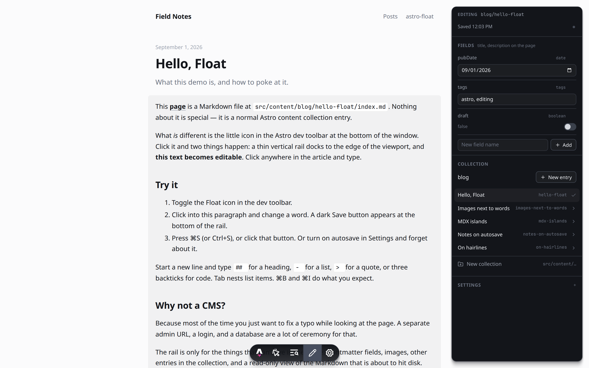
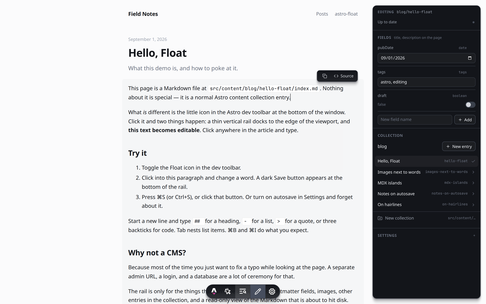
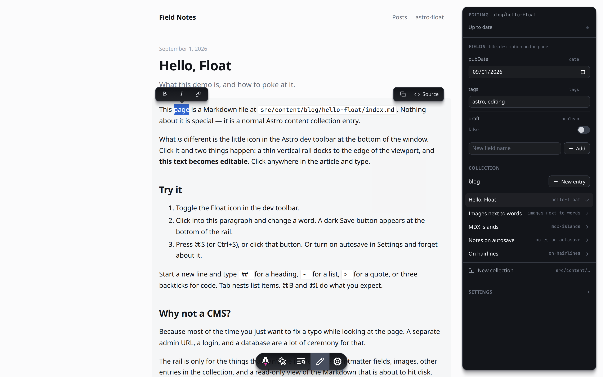
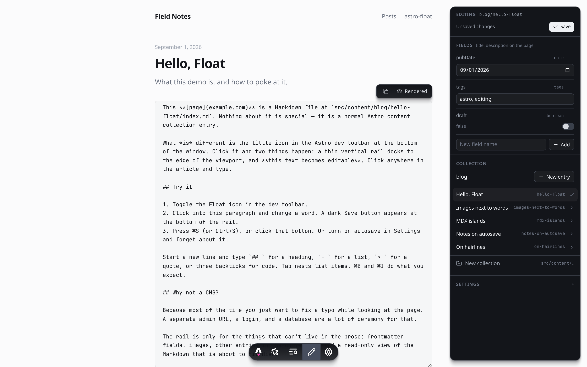
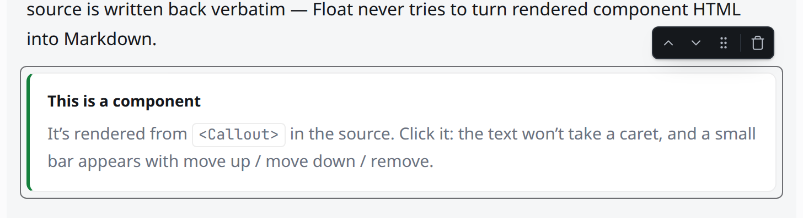
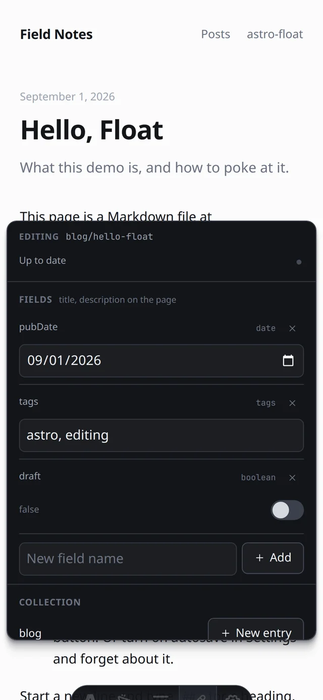
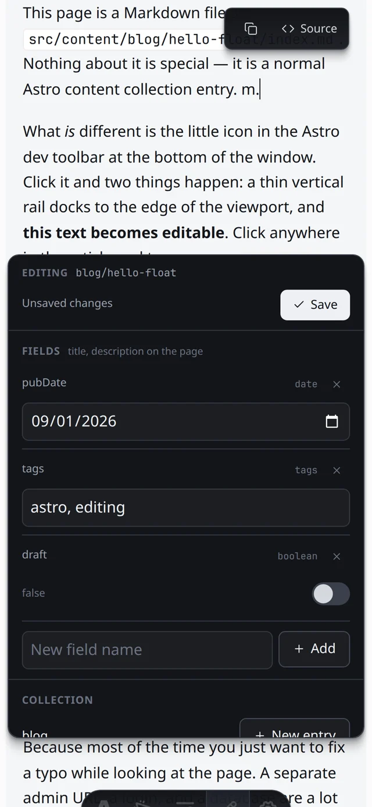

# astro-float

A proof-of-concept content editor for Astro content collections that lives **on the page**. Click **Edit** in the Astro Dev Toolbar and the rendered entry becomes editable where it sits — title, description, Markdown body. Anything editable takes a soft grey wash when you hover it; that's the whole visual language. A **sidebar** docks to the right for the few things that aren't on the page: the rest of the frontmatter, the collection, Save. Turn Edit off and both are gone.

No `/admin`, no desktop app, no CMS studio, no side textarea, no second always-on bar, no floating toolbar over the prose. Dev-only: the integration adds nothing to production builds.


## Preview it

```sh
git clone https://github.com/iannuttall/astro-float
cd astro-float
pnpm install
pnpm dev            # or: pnpm --filter demo exec astro dev
```

Open <http://localhost:4321/blog/hello-float/>, hover the bottom edge to reveal the Astro toolbar, and click the pencil (**Edit**). Hover the title or the article — grey means editable — and type. Click the pencil again to leave (unsaved work is saved first).

> Local `astro dev` is the only real preview path — the editor writes to your filesystem. A Vercel/Netlify preview would only show the plain blog, since the integration is stripped from builds. Set `allowRemote: true` to preview through a tunnel.



## On the page

| | |
| --- | --- |
| **Grey = editable** | With Edit on, hovering the title, the description, the body or any other bound field paints a soft grey wash behind it (lighter while your caret is inside). The wash is a pseudo-element painted behind the text and takes part in no layout — nothing moves when it appears. |
| **Type** | The body under `[data-float-body]` is `contenteditable`. Native caret, native undo, native spellcheck. Links don't navigate while editing (⌘-click does). |
| **Title & co.** | Elements marked `data-float-field="title"` (any string frontmatter key printed verbatim) are plain-text editable — Enter finishes. They save through the same path and are left **out of the sidebar**, since they're already on the page. |
| **Selection bubble** | Double-click or select text and a tiny bubble appears above it: **B**, *I*, link (inline URL field, Enter applies, Esc cancels). Gone on click-away. ⌘B / ⌘I / ⌘K still work. |
| **Region control** | While a region has your caret, a small control sits just above its top-right corner: **copy** its Markdown, or — for the body — switch to **Source**: the prose is replaced in place by a Markdown textarea. Type there, click **Rendered** and it saves and re-renders. Never on the words. |
| **Components** | MDX components and raw-HTML blocks are **islands**: no caret goes in, and clicking one shows a small bar — move up / down, drag grip, remove (inline confirm). Their source is written back verbatim wherever they end up. |
| **Shortcuts** | At the start of an empty line: `# `…`###### `, `- ` / `* `, `1. `, `> `, ``` ``` ```. **Tab / ⇧Tab** nest lists. In a code block Enter is a newline, ⇧Enter leaves it. **Esc** leaves the field (it never turns Edit off — the pencil does). |
| **Images** | Drop or paste onto the prose. The file is copied **next to the entry**, appears where you dropped it, and is written as ``. |
| **Save** | Top of the sidebar: status text, and a **Save** button the moment the page differs from disk (it stays put while you type). **⌘S / Ctrl+S** anywhere. Optional autosave (800ms after you stop typing). Turning Edit off saves first. |
| **Live preview** | While your caret is in the text, a save doesn't touch the DOM. Save from the sidebar (caret elsewhere) and Astro re-renders the page in place, no reload. |
| **Moving around** | While Edit is on, same-origin links, back/forward and Float's own create flows are soft navigations — fetch + swap under the sidebar, pending edits saved first, no "Leave site?". Edit off: links behave exactly as normal. |

<p>
  
  
</p>
<p>
  
  
</p>

## The sidebar

Only what isn't already on the page.

- **Editing** — the entry, status, **Save**.
- **Fields** — frontmatter minus anything bound on the page (title, description in the demo). Controls inferred from values: text, long text, number, date, tags, boolean, JSON. `slug` is shown read-only, never edited. Add / remove fields.
- **Collection** — entries in the selected collection (dropdown if several), current one marked; **+ New entry** asks for a title only and shows the derived path; **New collection** creates `src/content/<name>/`, registers it in `content.config.ts`, seeds a first entry and opens it.
- **Settings** — autosave, a cheat-sheet, the file path.

On phones (<640px) the sidebar is a bottom sheet above the Astro bar, sized to the visual viewport so the keyboard shrinks it instead of hiding its buttons; inputs are 16px (no iOS focus-zoom); Cancel on a form keeps the list where it was and snaps back a lingering zoom.

<p>
  
  
</p>

## Using it in your own Astro project

```js
// astro.config.mjs
import { defineConfig } from "astro/config";
import astroFloat from "astro-float";

export default defineConfig({
  integrations: [astroFloat()],
});
```

Then mark what's editable:

```astro
---
const { Content } = await render(post);
---
<article data-float-entry={`blog:${post.id}`}>
  <h1 data-float-field="title">{post.data.title}</h1>
  <p data-float-field="description">{post.data.description}</p>
  <div class="prose" data-float-body>
    <Content />
  </div>
</article>
```

- `data-float-body` — required for on-page body editing. It must wrap **only** the rendered body, because its children are what gets written back as Markdown.
- `data-float-field="title"` — optional, on any element that prints a string frontmatter value verbatim. Skipped automatically if the rendered text doesn't match the value (formatted dates etc.).
- `data-float-entry="collection:id"` — optional. Without it Float matches the URL tail against entry ids.

Zero config otherwise: every directory under `src/content/` that holds Markdown is a collection. Options, all optional:

```js
astroFloat({
  contentDir: "src/content",            // where collections live
  collections: {                         // pin dirs/routes instead of discovering them
    blog: { dir: "src/content/blog", route: "/blog/[id]" },
  },
  allowRemote: false,                    // answer non-localhost requests (astro dev --host, tunnels)
  maxUploadBytes: 15 * 1024 * 1024,
});
```

### New collections and routes

"New collection" writes a `defineCollection()` with a glob loader and a starter schema (`title`, `description`, `pubDate`, `tags`, `draft`) into `src/content.config.ts` (or creates the file), and adds the key to `export const collections`. It's a text edit that only touches shapes it recognises; if it can't find `export const collections = { … }` it says so and leaves the file alone. Astro picks the change up without a restart.

A collection also needs pages. The demo ships generic `src/pages/[collection]/index.astro` and `src/pages/[collection]/[id].astro` routes that render any collection without a dedicated page, so `/til/first-entry/` works the moment it's created.

## How it works

- **Dev toolbar app.** `addDevToolbarApp()` registers "Edit" (only when `command === "dev"`). The sidebar renders into the app's canvas, so Astro hides it when the app is off; page-side styles (wash, bubble, region control, island bar) are injected for the edit session and removed after. Edit state persists across reloads in `sessionStorage`; `beforeTogglingOff` saves pending work first. Escape keyups are stopped at the document while editing so Astro's "Escape closes the app" never fires mid-edit.
- **Block-level round trip.** The server parses the body with `mdast-util-from-markdown` (+ GFM, + MDX for `.mdx`) and returns each top-level block's exact source slice. The client lines those up with the body's top-level DOM children. On save it aligns the current DOM against that snapshot (LCS on outerHTML): unchanged blocks emit their **original Markdown byte-for-byte**; only edited or new blocks go through the HTML→Markdown serializer.
- **Islands.** `mdxJsxFlowElement`, raw `html` blocks and inline-JSX-only paragraphs are flagged by the server. On the client they get `contenteditable="false"`, a stable key, and are matched by that key (not by HTML) when serializing, so moving one just moves its source slice. An `.mdx` whose blocks don't line up is body-read-only (frontmatter still saves).
- **Source view.** The body's rendered container is hidden and a textarea with the current Markdown takes its place. Leaving it (or saving) writes that text and swaps in Astro's fresh render.
- **HTML→Markdown** (`src/toolbar/html-to-md.ts`) covers what remark-rehype + Shiki emit: ATX headings, paragraphs, tight/loose/nested lists, task lists, links + titles, images (Vite `/@fs/…` and Astro `/_image?href=…` URLs mapped back to `./relative`), inline code, fenced code with language, blockquotes, rules, GFM tables with alignment, strong / em / strike, hard breaks. Unknown elements pass through as raw HTML.
- **API.** `astro:server:setup` mounts `/__float/api/*`: collections, read/write entry, create entry, create collection, upload media. Localhost-only (host + socket address), same-origin, custom header on mutations, paths confined to the collection dir, image extension allowlist. Saves carry the file hash as loaded; a 409 gives you Reload / Overwrite.
- **No reload on save.** Astro's content layer full-reloads after a content change. `sync-gate.js` swallows that reload for a few seconds after a Float write and uses it as the "synced" signal, so save/create responses return once the store has the new content. IDE edits still reload as normal.

## Known round-trip limits (v0)

Only blocks you edit are re-serialized, so these only bite inside a paragraph you actually touched:

- **Markdown style is normalized**: `*emphasis*`, `**strong**`, `-` bullets, `1.` numbering, ATX `#` headings, fenced code. Setext headings, `+`/`*` bullets, reference-style links and autolinks in an edited block come back as the inline/ATX forms.
- **Smartypants**: Astro renders `'`/`"` as `’`/`“”`; edited blocks write straight quotes back (renders the same).
- **Raw HTML** that renders to more than one element, **footnotes**, or remark plugins that add wrappers break block alignment → whole-body re-serialize for `.md`, body-read-only for `.mdx`.
- **MDX**: component blocks are islands (move / remove only). Inline components inside a paragraph aren't islands — that paragraph is treated as text and would be rewritten with the component's rendered HTML if you edit it.
- **Escaping** is conservative: `* _ [ ] < \`` and line-leading `# - + > 1.` are escaped; `&` and single `~` are not.
- Programmatic conversions (typing `## ` etc.) aren't in the browser's undo stack. Native typing undo works.
- The bubble's bold/italic use `execCommand`, which produces `<b>`/`<i>`; the serializer writes `**`/`*`.

## Intentionally out of scope for v0

- **Component picker** — browse the project's components and insert one from the sidebar. Islands are the groundwork; the catalog/insert UI is the next pass.
- Zod schema awareness for Fields (types are inferred from values); the starter schema for new collections is fixed
- Renaming slugs, deleting entries or collections, git operations
- JSON/YAML data collections, remote loaders, live-loader / `<ClientRouter />` pages
- Auth, multi-user, anything outside `astro dev`

## Repo layout

```
packages/astro-float/   the integration (what you'd publish to npm)
  src/index.js            Astro integration: Dev Toolbar app + dev API
  src/server/api.js       /__float/api/* endpoints (localhost-only JSON)
  src/server/blocks.js    Markdown/MDX → top-level source blocks (mdast, with offsets, islands flagged)
  src/server/collections.js  create a collection: dir, content.config.ts wiring, seed entry
  src/server/content.js   frontmatter parse/serialize, collection discovery, entries, uploads
  src/server/sync-gate.js swallow Astro's post-save reload, signal "content synced"
  src/toolbar/app.ts      defineToolbarApp(): the Edit toggle
  src/toolbar/float.ts    edit-mode lifecycle, the sidebar, source view, soft navigation
  src/toolbar/editor.ts   on-page contenteditable controller, block alignment, islands, page styles
  src/toolbar/fields.ts   on-page frontmatter fields (title, description, …)
  src/toolbar/overlays.ts region control (copy / source) and the selection bubble
  src/toolbar/html-to-md.ts  HTML → Markdown for edited blocks
  src/toolbar/styles.ts   sidebar styles (Astro-toolbar palette); mobile sheet
demo/                   a minimal Astro 5 blog (+ one .mdx post) + generic [collection] routes
docs/                   screenshots (docs/mobile/ for the phone set)
```

## Notes

- Astro prints `[glob-loader] Duplicate id … found` after every content save. That's Astro's own watcher log for changed files, not a Float bug.
- Astro's audit app strips `data-astro-source-*` attributes shortly after load; Float strips them first so component-rendered blocks don't look edited.
- If you delete an image that a post referenced, Astro's `.astro/` asset cache can 500 the page until you restart `astro dev`.
- Tested against Astro 5.18 / Vite 6 / Chrome (desktop + iPhone emulation). Real iOS Safari's `contenteditable`, selection and keyboard behaviour are untested here; HTML5 drag of islands doesn't exist on touch (use ▲/▼); the selection bubble relies on `selectionchange`, which mobile long-press selection also fires.
- Prefs (autosave) live in `localStorage` under `astro-float:prefs`.
